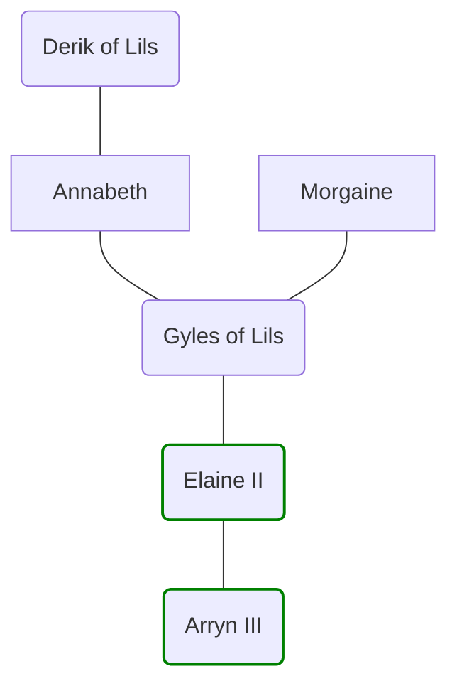

# The House of Lils
>[!info]+ Summary
>`$=dv.view("_scripts/view/get_PageDatedValue")`

A cadet branch of the [[House of Sewick]], which came to the throne in the 1720s. The house descends from the youngest child of [[Elaine I]] and a Tyrwinghan [[Oracle of the Riven]], [[Morgaine]].

