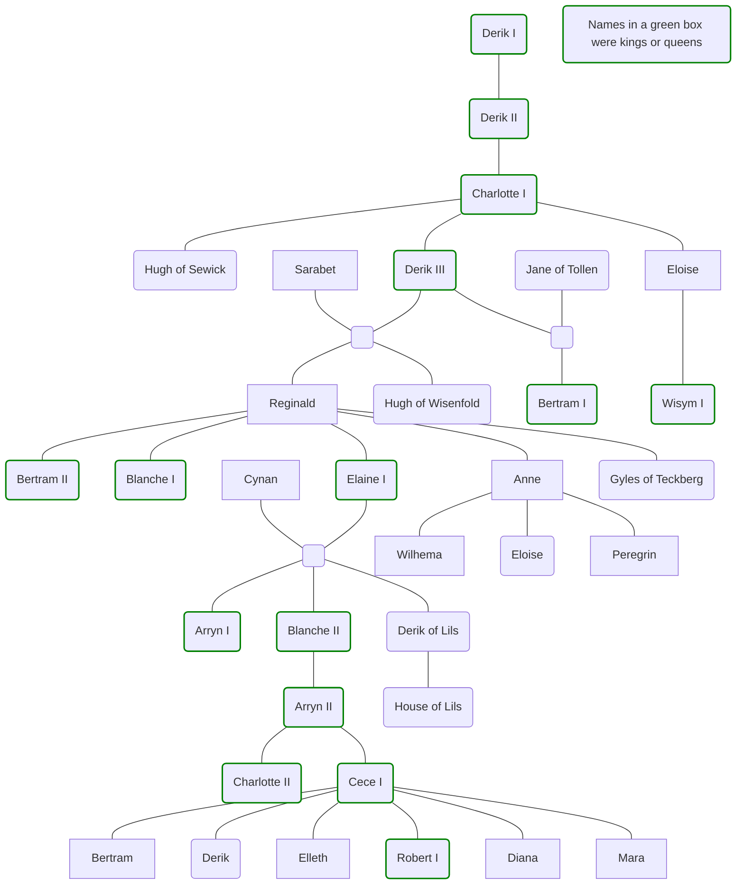

# The House of Sewick
>[!info]+ Information
> A [[Sembara|Sembaran]] noble house
> `$=dv.view("_scripts/view/get_PageDatedValue")`
> `$=dv.view("_scripts/view/get_Affiliations")`

The founding royal house of modern [[Sembara]], the House of Sewick ruled between the 1420s and the 1720s. A cadet branch, the [[House of Lils]] rules today.




%%^Campaign:None%%
### Members

```dataviewjs
const { util } = customJS
dv.table(["Person", "Info", "Born", "Died"], 
			dv.pages("#person")
				.where(f => util.isOrWasAffiliated(dv.current().file.name, f.file))
				.sort(b => b.born)
				.map(b => [util.s("<name> (<pronouns> <pronunciation>)", b.file, dv.current().pageTargetDate), util.s("<ancestry> <maintype>", b.file, dv.current().pageTargetDate), util.s("<startStatus> <startDate>",b.file, dv.current().pageTargetDate), util.s("<endStatus> <endDate>",b.file, dv.current().pageTargetDate)]))
```
%%^End%%