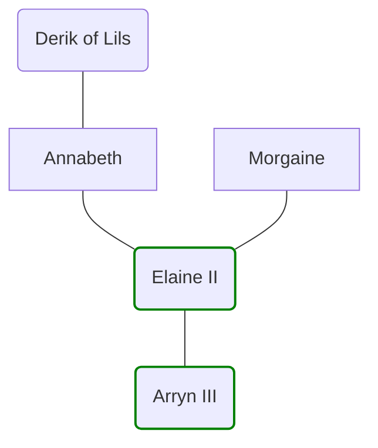

### House of Lils

A cadet branch of the [[House of Sewick]], which came to the throne in the 1720s.

```mermaid 

graph TD

Derik(Derik of Lils) --- Annabeth
Annabeth --- ElaineII(Elaine II)
Morgaine --- ElaineII
ElaineII --- ArrynIII(Arryn III)

classDef ruler stroke:green,stroke-width:2px
class ElaineII,ArrynIII ruler;
class Annabeth,Morgaine,ElaineII,ArrynIII,Derik internal-link;


```