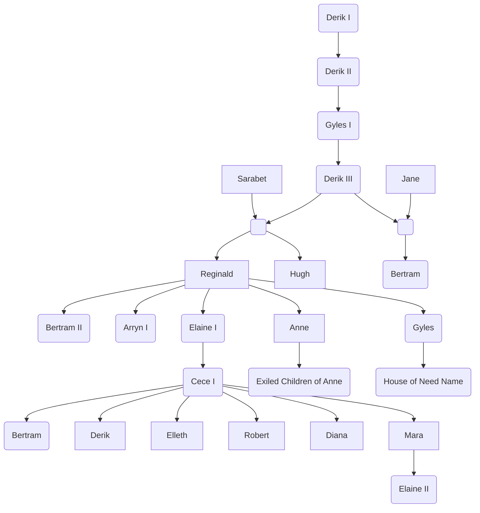

### The House of Sewick

The Sembaran Royal house, founded by Derik I in the 1420s.

```mermaid 
graph TD

D1(Derik I) --> D2(Derik II) --> G1(Gyles I) --> D3(Derik III)
Sarabet --> D3Kids( )
D3 --> D3Kids( )
D3Kids --> Reginald
D3Kids --> Hugh
D3 --> D3Kids2( )
Jane --> D3Kids2( )
D3Kids2 --> Bert1(Bertram)
Reginald  --> B2(Bertram II)
Reginald  --> AI(Arryn I)
Reginald  --> E1(Elaine I)
Reginald  --> Anne
Reginald  --> GylesCadet(Gyles)
E1 --> C1(Cece I)
Anne --> AnneChildren(Exiled Children of Anne)
C1 --> Bert2(Bertram)
C1 --> Derik
C1 --> Elleth
C1 --> Robert
C1 --> Diana
C1 --> Mara
Mara --> E2(Elaine II)
GylesCadet --> HOfNeedName(House of Need Name)
```

