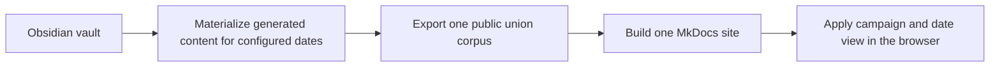

# Dynamic Taelgarverse Build and Implementation Plan

> [!warning] Proposal
> This note describes a proposed implementation. It does not change the behavior of the current Taelgarverse build. Source-data preparation and migration are specified in [[Dynamic Taelgarverse Content and Metadata Transition Plan]].

## Objective

Replace campaign/date-specific Taelgarverse builds with one public site that lets a reader select:

1. one global in-world date; and
2. zero, one, or multiple campaign perspectives.

The site should present the same source note differently according to those settings without generating and maintaining a separate site for every campaign/date combination.

## Product semantics

### Date

The selected date answers:

> What state was the world in at this date?

It controls:

- authored date blocks;
- generated headers, including lifecycle, age, whereabouts, affiliations, and leadership;
- date-sensitive generated queries and lists where relevant.

The initial public interface should use a small registry of exact date presets rather than arbitrary free-form date entry. Proposed perspectives currently include approximately:

- current Addermarch, around 1715;
- current or final Cleenseau, around 1720;
- end of Into the Chasm, around 1735;
- end of Lost in the Feywild, around 1740;
- end of Labyrinths of the Lost, around 1748;
- current Mawar, around 1749;
- end of Dunmari Frontier, around 1750;
- current Great Library, around 1752.

Each approximate date must be replaced with an exact configured date before release.

### Campaigns

The selected campaign set answers:

> Which campaign-specific context and campaign-relevant browsing results should I see?

It controls:

- authored campaign blocks;
- page visibility in navigation, indexes, search, and generated lists;
- the campaign sections shown in Campaign Appearances;
- campaign relevance ranking.

Unmarked general text remains visible. A campaign block contains exactly one campaign code and is visible if that campaign is selected.

### Campaign knowledge is not backdated

Campaign selection represents the campaign's current or final knowledge. The implementation does not reconstruct “this campaign as of Session 50.”

Campaign and date are independent controls. A reader may therefore create a hybrid view such as Dunmari Frontier campaign context over the world in 1715. Named profiles should pair campaigns with their normal date, but the interface should not claim that arbitrary combinations represent historically exact party knowledge.

### Publication boundary

Campaign and date filtering are reader-convenience features, not access control. Any public variant shipped in site HTML or data can be inspected.

The following are hard publication boundaries:

- `audience: [none]` pages are not shipped.
- `%%SECRET[v2:2813636d58fe60b6f07f9b3fae26e409]%%` content remains outside GitHub sharing and public output.
- ordinary `%% ... %%` comments are shared through Git but omitted from public output.
- `%%^Campaign:none%%` content is shared through Git but stripped before public output.
- ignored/private directories and other explicit private-source rules remain excluded.

## User experience

### Global controls

Add a persistent Taelgarverse view control containing:

- a single-select date menu;
- multi-select campaign controls;
- named profile shortcuts;
- an “all campaigns” action;
- a way to reset to the default view.

Campaigns should be grouped as active and archived. Minor and archived campaigns remain available without occupying the most prominent part of the interface.

### Profiles, not sites

A profile is a saved combination of one date and one or more campaigns. Examples:

- Addermarch now;
- Great Library now;
- Cleenseau;
- Dunmari Frontier archive;
- a player-specific collection of campaigns.

Profiles do not create separate builds or URLs for duplicate sites. The current selection should be:

- stored in `localStorage` for return visits;
- encoded in query parameters or another stable URL representation for sharing;
- initialized from a named profile when one is supplied;
- applied consistently after MkDocs Material instant navigation.

### Page behavior

Pages matching the selected audience appear normally.

A direct link to a public page outside the current campaign selection should not produce a false 404. It should show a compact notice such as:

> This page is outside your current campaign view.

The reader can reveal the page, add a relevant campaign, or return to the current browse context.

The initial implementation should not hide a page merely because its subject has not yet been born or created. Date changes page state; page membership is governed by audience. If page-level chronological suppression is later desired, it must be introduced as an explicit feature rather than by retaining ambiguous `activeYear` behavior.

### Campaign Appearances

Provide a compact player-facing component on applicable entity pages:

- show only selected campaigns by default;
- group appearances by campaign;
- link the first and most recent session appearances;
- show a count and an expandable list of other appearances;
- incorporate useful curated `campaignInfo` highlights;
- report “known to campaign; no linked session recorded” when `knownTo` has no matching session evidence;
- keep build/editor warnings about suggested missing `knownTo` out of the player-facing display.

Data roles:

- `knownTo` is authoritative for current/final campaign knowledge;
- session backlinks provide comprehensive appearance evidence;
- `campaignInfo` provides sparse curated highlights;
- `audience` controls page browsing visibility.

## Configuration

### Campaign registry

All consumers must use the canonical campaign registry proposed at `_scripts/config/campaigns.json`. The site may select a subset of registered campaigns for its public controls, but it must not maintain a second incompatible mapping of codes, aliases, party pages, or session folders.

### Site view configuration

Taelgarverse-specific configuration should define:

- public campaign codes and display order;
- active/archived grouping overrides if needed;
- exact date presets with stable IDs and labels;
- named profiles pairing one date with campaign selections;
- the default profile;
- whether a profile is shown prominently or only through archived/minor views.

Representative structure:

```json
{
  "datePresets": [
    {"id": "dufr-end", "label": "Dunmari Frontier end", "date": "1750-01-01"},
    {"id": "gl-current", "label": "Great Library current", "date": "1752-01-01"}
  ],
  "profiles": [
    {"id": "dufr", "label": "Dunmari Frontier", "datePreset": "dufr-end", "campaigns": ["DuFr"]},
    {"id": "gl", "label": "Great Library", "datePreset": "gl-current", "campaigns": ["GL"]}
  ],
  "defaultProfile": "dufr"
}
```

The dates above illustrate structure only and must not be adopted as campaign dates without confirmation.

## Target architecture



The build produces one HTML page per public note. Date-dependent fragments may have multiple variants within that page, but assets, links, navigation structure, and general prose are shared.

## Build pipeline

### 1. Load and validate configuration

Before scanning notes:

- load the canonical campaign registry;
- load site date presets and profiles;
- validate that every referenced campaign code exists;
- validate exact preset dates;
- validate that profile IDs, preset IDs, and public campaign IDs are unique;
- compute stable configuration digests for incremental builds.

Configuration errors should fail before materialization or export performs destructive or expensive work.

### 2. Materialize a date-aware source corpus

The current materializer regenerates website headers and Dataview output at one target date. Extend it to accept the complete preset registry in one run.

For each note:

1. Generate its website header at every configured date using the existing date, whereabouts, and affiliation engine.
2. Group identical rendered headers.
3. Emit one static header if every date produces the same output.
4. Otherwise emit the smallest set of date-scoped header variants.

The renderer should receive the target date explicitly rather than relying on ambient Calendarium/Fantasy Calendar state. Existing functions that currently obtain a global target date should accept or propagate the configured date so output is deterministic and testable.

This does not require adding dates to metadata that is correctly timeless. Identical results are intentionally deduplicated.

### 3. Handle Dataview and DataviewJS output

The source corpus contains generated queries in addition to headers. Classify materialized blocks as:

- date-independent: render once;
- date-dependent: render for each preset and deduplicate identical results;
- campaign/page-list output: preferably render a union whose rows can be filtered using the page manifest;
- unsupported or ambiguous: report explicitly.

Do not promise a globally date-correct site while silently leaving current-date location, affiliation, leadership, or alive/dead queries frozen at the build date.

The materializer should avoid copying and reprocessing the entire vault once per preset. It should reuse one Obsidian runtime and repeat only date-sensitive rendering work.

### 4. Scan the public union corpus

Refactor the website scanner so campaign and date selections no longer delete public variants at build time.

The scanner should:

- exclude `audience: [none]` pages;
- apply private-directory and ignore rules;
- retain every page visible in at least one public audience;
- stop excluding pages by a single configured campaign set;
- stop excluding pages by `activeYear` after legacy cutover;
- compute effective audience from `knownTo`, applicable `campaign` values on session notes, campaign meta pages, and campaign source material, plus explicit `audience`;
- report unclassified pages;
- retain metadata necessary for navigation, search, backlinks, lists, and direct-page notices.

The link index must be built over the union corpus so links resolve consistently across views.

### 5. Parse and transform authored content blocks

Replace regular-expression-only stripping with a validated block parser.

Supported authored blocks:

- `Campaign:Code` — one canonical campaign;
- `Campaign:none` — hard private exclusion;
- `Date:X` — visible from `X` onward;
- `Date:Xb` — visible before `X`; `b` means "before."

The source pass must also recognize two Obsidian comment forms outside that structured-block grammar: local-only `SECRET` blocks and ordinary Git-shared comments. Neither is a legacy alias for `Campaign:none`.

The parser must:

- validate markers and terminators;
- reject unknown campaigns, lists, negation, or `all` in campaign blocks;
- normalize dates through one shared date implementation;
- reject same-type nesting;
- eventually allow cross-type campaign/date nesting as logical AND;
- remove ordinary comments and `Campaign:none` content before link extraction, search indexing, backlinks, and HTML generation;
- verify that SECRET content is absent before any GitHub or public-build artifact is created, without copying its contents into shared diagnostics;
- distinguish generated header variants from authored blocks;
- preserve Markdown rendering inside public blocks.

Public blocks should become scoped HTML containers or equivalent structured fragments with precomputed visibility metadata. The browser should not need to implement Taelgar date parsing.

For a small preset list, the exporter may encode the preset IDs for which a fragment is visible. This avoids duplicating date arithmetic in JavaScript and ensures build-time and browser behavior agree.

### 6. Emit a page/view manifest

Generate a compact versioned manifest keyed by stable page URL or slug. Each page record should include at least:

- title and URL;
- tags/page type needed by browse surfaces;
- explicit and effective audience;
- directly known campaigns from `knownTo` for relevance ranking;
- campaign identity for session notes, campaign meta pages, and campaign source material;
- whether the page is globally relevant;
- search/list visibility information;
- optional Campaign Appearances data or a reference to it.

The same computed record must drive navigation, search, generated lists, direct-page notices, and campaign relevance ranking. Do not duplicate effective-audience logic independently in several JavaScript components.

The build should also write a human-readable audit showing declared audience, inferred audience, exclusions, and final effective audience.

### 7. Transform and render notes

For each union-corpus note:

- preserve ordinary prose once;
- insert date-scoped generated header variants;
- transform authored public campaign/date blocks into scoped fragments;
- exclude private blocks before transforming links;
- retain page audience metadata in generated frontmatter or the manifest;
- render Campaign Appearances data or a stable placeholder/component target;
- collect link and asset dependencies across every public variant.

Assets should remain shared. An asset referenced only by hidden-in-the-current-view public content must still be copied because another view can reveal it. Assets referenced only by hard-private content must not become linked merely through that private reference.

### 8. Generate navigation

Build one complete navigation tree from the union corpus.

Each page item should carry or resolve its audience through page metadata or the manifest. Browser filtering must:

- hide pages outside the selected campaigns;
- retain globally relevant pages;
- hide empty directory/section containers;
- preserve active-page and index behavior;
- reapply after instant navigation;
- avoid leaving pruned navigation links pointing to a hidden first child.

Campaign selection affects page browsing visibility. Date does not initially remove whole pages from navigation.

### 9. Build MkDocs once

MkDocs continues to produce one static GitHub Pages site. It should not build separate directory trees for campaigns, dates, profiles, or combinations.

The MkDocs configuration and overrides must make scoped metadata available to:

- primary navigation;
- secondary table of contents;
- backlinks;
- search;
- page content;
- instant-navigation lifecycle hooks.

### 10. Apply the selected view in the browser

Extend the existing Taelgarverse JavaScript rather than creating a separate application shell.

The view controller should:

- load and validate saved/query-parameter selection against current configuration;
- render accessible date and campaign controls;
- show/hide scoped fragments;
- filter page-index/list elements using target-page audience;
- filter navigation and empty sections;
- update Campaign Appearances;
- persist the selection;
- update the shareable URL without breaking navigation history;
- reapply state after MkDocs Material instant navigation and dynamic content replacement;
- dispatch a custom view-change event so maps, lists, and future components can respond.

Use an early default-state mechanism to avoid briefly flashing every hidden variant while JavaScript initializes.

## Search

Search is a separate implementation requirement, not a consequence of hiding DOM elements.

The default MkDocs search index will otherwise contain:

- pages outside the selected audience;
- hidden campaign paragraphs;
- multiple date variants of the same text;
- snippets that reveal text not displayed in the active view.

The completed implementation must make search view-aware. Viable approaches include:

1. generate structured search records with page and fragment scopes, then filter records and snippets in the client; or
2. produce one compact shared lexical index with scope metadata attached to indexed sections.

Page-level result filtering alone is an acceptable intermediate milestone only if the limitation is explicit. It does not solve hidden-fragment snippets or duplicate date variants.

Search acceptance criteria:

- out-of-audience pages do not appear in scoped search results;
- hidden campaign/date text does not produce a visible snippet;
- identical date variants are not duplicated;
- changing the view updates subsequent results without a rebuild;
- “all campaigns” can find every shipped public campaign variant.

## Generated lists, tables, and cards

Pages containing people, places, objects, sessions, or campaign indexes must use the same manifest.

For ordinary target-page collections:

- render a union list;
- attach the target page URL or stable ID to each row/card;
- filter by effective audience in the browser;
- re-sort or reflow after filtering;
- rank `knownTo` relevance above generic `audience: [all]` relevance when useful.

For genuinely date-dependent queries, materialize date variants rather than attempting to infer query semantics in the browser.

## Backlinks and table of contents

### Backlinks

Page-level backlink filtering can use the source page's audience. Perfect fragment-level filtering additionally requires the build to retain the scope of the source link.

Implementation stages:

1. filter backlinks originating from wholly out-of-audience pages;
2. retain source-fragment scope so links inside hidden campaign/date blocks do not create misleading visible backlinks;
3. exclude private-block links before backlink generation entirely.

### Table of contents

Headings inside hidden campaign/date fragments must not leave visible table-of-contents entries. The build may annotate TOC entries with fragment scope or the browser may resolve each entry to its source heading and mirror its visibility.

## Campaign Appearances data

Build a deterministic appearance index from session-note links.

For every public entity page:

1. Find backlinks from recognized session-note folders or notes with a registry-resolvable `campaign`.
2. Group sessions by canonical campaign code.
3. Sort by in-world date, then session number/name as a stable fallback.
4. Record first, most recent, count, and all linked sessions.
5. Merge curated `campaignInfo` highlights without turning every backlink into frontmatter.
6. Compare the result with `knownTo` for editor/build warnings.

The appearance index should be generated as sidecar data or embedded page metadata and used consistently by both Obsidian-facing review tools and Taelgarverse.

Session backlinks indicate appearances, not automatically authoritative knowledge. Suggested missing `knownTo` values belong in audit output.

## Legacy compatibility and cutover

### Before cutover

- Continue honoring `excludePublish` in current static builds.
- Continue honoring `activeYear` where the current static scanner uses it.
- Allow newly added `audience` to coexist without changing current output.
- Preserve existing `campaignInfo` header behavior until the replacement Campaign Appearances presentation is validated.
- Correct and test the existing date-block semantics before content cleanup relies on them.

### During dynamic shadow builds

For each named campaign profile:

- compare the union site's visible pages with the corresponding legacy build;
- compare visible authored campaign/date blocks;
- compare generated headers at the profile date;
- compare navigation, search, backlinks, and major generated indexes;
- explain every difference as an intentional metadata correction, known limitation, or implementation defect.

Cleenseau may retain its separate build during this validation period because it currently serves a non-overlapping player group. It should become a normal profile only after its page and content comparison is accepted.

### At cutover

- make the dynamic union site the maintained Taelgarverse deployment;
- remove campaign/date filtering from normal export configuration;
- stop consuming `excludePublish` and `activeYear`;
- remove those fields from source notes only after the new audience mappings are live;
- retire duplicate campaign sites after preserving any desired archive links or redirects;
- update authoritative `_MoC` documentation from the adopted proposal.

## Testing strategy

### Unit tests

Campaign registry:

- canonical codes and aliases;
- duplicate/unknown codes;
- active/archived status;
- session-folder resolution.

Audience:

- `knownTo` inference;
- applicable session/meta/source `campaign` inference;
- rejection of `campaign` as audience identity on ordinary in-world entities;
- explicit additions;
- `all`, `none`, and negation;
- contradiction warnings;
- unclassified pages.

Blocks:

- one-code campaign blocks;
- `Campaign:none` hard stripping;
- ordinary comment stripping;
- SECRET presence checks that do not expose content;
- from-date inclusive boundary;
- before-date exclusive boundary;
- year/month/day precision;
- paired replacement states;
- invalid and unmatched markers;
- allowed cross-type and rejected same-type nesting.

Date rendering:

- identical-header deduplication;
- lifecycle transitions;
- whereabouts and affiliation changes;
- partial-date normalization;
- quoted versus numeric YAML date forms;
- deterministic explicit target dates.

### Integration fixtures

Create a small synthetic vault containing:

- a global page;
- a campaign-specific page;
- an in-world entity inside a campaign directory that uses `knownTo`, not `campaign`;
- a multi-campaign known page;
- a never-publish page;
- public and private campaign blocks;
- paired date-state blocks;
- a dated person with changing whereabouts and affiliations;
- session notes linking that person from multiple campaigns;
- generated lists and backlinks.

Assert the complete output for several profiles without using the full vault.

### Browser tests

Test:

- campaign multi-select and all-campaign behavior;
- date switching;
- named profiles;
- persistence and shareable URLs;
- instant navigation and browser back/forward;
- direct links to out-of-view pages;
- navigation pruning and empty sections;
- Campaign Appearances expansion;
- search scopes and snippets;
- TOC and backlinks;
- mobile controls, keyboard operation, and screen-reader labels;
- print and no-JavaScript fallback behavior;
- absence of private content in downloaded HTML and data.

### Full-vault validation

- Run registry, audience, content-block, and legacy-field audits.
- Build the union corpus.
- Build MkDocs once.
- Compare named profiles with legacy static outputs.
- Inspect representative people, places, organizations, events, campaign indexes, maps, and session notes at multiple dates.
- Measure build time, generated HTML, search data, manifest size, and complete deployed size.

Materialization remains destructive and slow; full materialization must continue to require explicit confirmation under the Taelgarverse repository workflow.

## Performance and size strategy

- Build one site, not the Cartesian product of campaigns and dates.
- Share assets across every view.
- Render general prose once.
- Deduplicate identical date-rendered headers and generated query results.
- Repeat only date-sensitive materialization work in one Obsidian runtime.
- Keep the page/view manifest compact and cacheable.
- Avoid one complete search index per profile if scoped records can share lexical data.
- Preserve incremental export behavior by hashing source, registry, view configuration, and variant inputs.

Campaign blocks and audience metadata add little data. Date-rendered header and query variants are the principal new text cost. Search design, not page HTML, is the most likely source of avoidable duplication.

## Implementation stages

### Stage 0: data contract and fixtures

- Complete the readiness work in [[Dynamic Taelgarverse Content and Metadata Transition Plan]].
- Add canonical campaign registry loading and validation.
- Freeze exact block semantics and create focused fixtures.
- Fix the existing static date-block direction and boundary tests.

### Stage 1: public union exporter

- Compute effective audience.
- Exclude hard-private pages and blocks.
- Retain all public campaign/date variants.
- Implement the validated block parser.
- Emit the page/view manifest.
- Preserve one page per note and shared assets.

Deliverable: a union build whose raw generated Markdown/HTML has correct scopes, before full interactive filtering.

### Stage 2: date-aware materialization

- Pass explicit preset dates through header rendering.
- Generate and deduplicate header variants.
- Inventory and classify date-sensitive Dataview output.
- Add variant rendering for the required date-sensitive queries.

Deliverable: switching among test dates produces correct world-state fragments.

### Stage 3: campaign/date interface

- Add global controls, profiles, persistence, and URLs.
- Filter page fragments, navigation, ordinary lists, and direct-page state.
- Reapply state after instant navigation.
- Add accessible responsive styling.

Deliverable: usable browsing for active and archived campaign profiles.

### Stage 4: Campaign Appearances

- Generate the session appearance index.
- Merge curated `campaignInfo` highlights.
- Add the compact expandable page component.
- Add editor/build warnings for `knownTo` discrepancies.

Deliverable: players can quickly identify where an entity appeared without long YAML logs.

### Stage 5: search, backlinks, TOC, and complex indexes

- Implement view-aware search records and snippets.
- Add fragment-aware backlinks.
- Hide scoped TOC entries.
- Convert or variant-render remaining complex generated indexes.

Deliverable: secondary discovery surfaces agree with the selected view.

### Stage 6: shadow validation and cutover

- Compare named profiles with legacy outputs.
- Resolve metadata and implementation discrepancies.
- Validate performance, site size, private-content exclusion, and GitHub Pages deployment.
- Cut over the main site.
- Remove legacy fields and duplicate build configurations only after acceptance.

## Likely code and configuration areas

### Taelgar vault

- canonical campaign registry;
- CustomJS date/output functions;
- materializer plugin and wrapper support for multiple target dates;
- audience/block/knownTo audit tooling;
- Campaign Appearances sidecar generation;
- adopted `_MoC` documentation.

### `taelgar-utils/website`

- configuration schema;
- scanner and page-skipping logic;
- campaign/date block parser;
- note transformation and rendering;
- manifest generation;
- navigation generation;
- link/backlink scope tracking;
- search data generation;
- focused unit and integration tests.

### Taelgarverse site repository

- site-specific date presets and profiles;
- `website.json` migration from fixed filters to union configuration;
- MkDocs theme partials for scoped navigation, TOC, backlinks, and controls;
- Taelgarverse JavaScript and CSS;
- browser tests and legacy-profile comparisons;
- deployment and redirects at cutover.

Generated `docs`, `taelgar-static`, and copied overrides remain build outputs and must not receive durable fixes.

## Risks and deliberate compromises

- Campaign/date combinations may be historically hybrid because campaign knowledge is not backdated.
- Hidden public content is inspectable and must not contain secrets.
- Incomplete audience or `knownTo` metadata will cause incorrect browsing even if the engine is correct.
- Search, backlinks, TOC entries, and Dataview-generated indexes require explicit scoping; CSS-only content hiding is insufficient.
- Partial dates must have one consistent normalization across Python, JavaScript, YAML types, and block markers.
- Direct-page behavior must distinguish “outside this view” from “not published.”
- Multiple date variants increase generated text, but should remain much smaller than duplicating complete sites and assets.

## Open decisions before implementation

- Canonical short codes for campaigns not already registered.
- Exact date values and labels for each public preset.
- Default profile and whether an explicit general/no-campaign view is offered.
- Which archived/minor campaigns appear directly in the selector.
- Final query-parameter format for shareable views.
- Final placement and styling of Campaign Appearances.
- Whether every current `campaignInfo` highlight remains player-facing.
- Exact fallback behavior for no JavaScript and printing.

## Acceptance criteria

The implementation is complete when:

- one deployed site supports every approved date and campaign profile;
- changing campaign selections updates campaign text, page browsing, lists, search, backlinks, TOC, and Campaign Appearances consistently;
- changing the date updates authored date blocks and all required generated world-state output;
- unchanging headers and generated output are stored only once where practical;
- selected views persist and can be shared;
- archived and multi-campaign/player views work without separate builds;
- direct links handle out-of-view public pages clearly;
- SECRET content, ordinary comments, `Campaign:none`, `audience: [none]`, and other nonpublic material are absent from public artifacts;
- legacy profile comparisons have no unexplained differences;
- build time and deployed size remain within the repository's documented deployment constraints;
- `excludePublish` and `activeYear` can be removed without changing intended publication behavior;
- authoritative `_MoC` documentation reflects the adopted system rather than this proposal.
