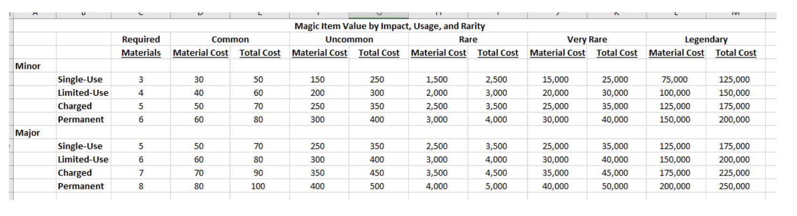

Thinking through "economy" / money / gold.
 
-I don't want to sweat small expenses (silvers and coppers and rations and things like that)  
-I don't want to give out a lot of treasure, since just random hoards of coins don't really make sense  
-I want wealth to be a route to crafting better items / magic items, although hard to find in Karawa
 
Generally speaking, policy:
 
Use the lifestyle expenses heavily, doubling to account for rations and other consumables
 
**Lifestyle Expenses**
 
|   |   |
|---|---|
|**Lifestyle**|**Price/Day**|
|Wretched|—|
|Squalid|2 sp|
|Poor|4 sp|
|Modest|2 gp|
|Comfortable|4 gp|
|Wealthy|8 gp|
|[Aristocratic](https://roll20.net/compendium/dnd5e/Aristocratic#h-Aristocratic)|20 gp minimum|
 
So, 2/gp a day gets you rations, ammunition, a modest room, food & drink, and the like.
 
In Karawa, these costs are covered due to status as protectors of town, so only relevant if they go elsewhere (Tokra, etc).
 
Two weeks is about 30 gp/person, so make sure that is not a terribly difficult expense at all times. If they start running low, give them more treasure.
 
Cost of stuff:
 
Generally speaking, a skilled worker expects to earn 1-5 gp/day, and an unskilled worker 1-5 sp/day. So for custom stuff, figure a rough cost of materials plus labor based on # days / work. Generally most items are 20-50% labor, the rest material. So something that will take a skilled artisan 3 days is like 6-10 gp.
 
Think of in general 5 gp is the most a skilled worker (unleveled, no magic) could earn in a day, and 1 sp is the least an day laborer would earn. There is obviously a lot of income inequality here, and no one is really paid in coin, especially among the unskilled.
 
A skilled artisan may have a few hundred gold in savings, whereas a peasant is unlikely to have more than a handful of gold, at best.
 
Materials:
 
Metal, wood, leather is expensive, that is one of the major costs that go into items (say at least 50%). These are valuable trade goods, along with alcohol, spices, salt, etc.
 
Magic:
 
Magic exists is an entirely different economy, and largely comes in 3 flavors:
 
1. Consumable items or 'toy' enchantments (common magical items) that are reasonably common and can be bought/sold in many places, generally between 10-50 gp and in any case \< 100 gp:

1. Custom-crafted items, which can be complex but require a specialized artisan to produce. In some cases these may not be technically magical, e.g. a masterwork item, but follow magic item pricing. E.g. a masterwork sword that gives +1 to damage would be an common permanent item, so around 80-100 gp plus cost of sword. This is roughly equivalent to silvered cost (100 gp).
2. Legendary artifacts of past empires: this is a lot of the uncommon and rarer "standard" D&D magic items