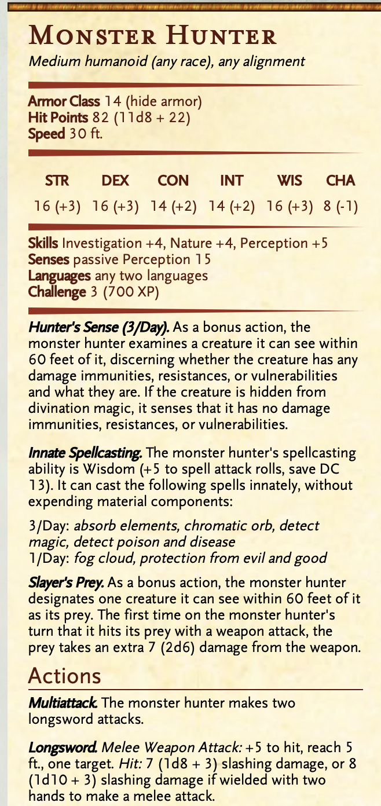

\> [!caution] This page contained a drawing which was not converted.   

Connections: [Neck](Neck.md), [Thigh #1](Thigh%201.md), [Thigh #2](Thigh%202.md),

Scene:
 
Large, open cavern, perhaps 250-300' across. Definitely cannot see the whole area. Several buildings, some ruined, some largely intact.
 
The biggest building is a large temple -- it is constructed of huge blocks of stone, seemingly without seams or masonry, extending into the darkness above. A set of carved steps ascend to the main entrance, which is flanked by blocky hexagonal pillars with runic designs on them. A large set of stone doors, 10' tall, stand at the top of the stairs.
 
Surrounding the temple are several smaller outbulidings, in a simpler style. One has a collapsed roof and seems largely ruined, the other two are more intact.
 
Smooth paths on the floor weave around a variety of amazing sights. The temple itself is surrounded by carefully tended trees of crystal that sparkle and reflect light. Several have shattered, but a few are intact and you can imagine how brilliant this must have been all lit up.
 
On the outskirts of the complex, the paths lead off in all directions towards the walls. The occasional cracked stone pillar may have once held lights, and an elaborate iron construction, twisted beyond recognition, may have been a fountain.
 
General terrain: the ceiling is about 80' up, so cannot see it unless have darkvision or a source of light that extends more than 60'. The floor is a mix of clearly carved and smoothed roads, carefully tended natural cave formations, and rubble.
 
Anyone who can speak Dwarven will recognize this as Dwarven architecture / construction. More information would require an Intelligence (Religion or History) check.

1. Less than 10, don't get anything
2. 10-15 some minor information:
    1. definitely carved by dwarves, seems old, looks like something religious
3. Better than 15, learn a fair amount:
    1. Temple complex, looks very old - although Dwarven architecture tends to be pretty conservative, this even has signs of being old in the style of embellishment, probably at least 500 years old; a temple to the Bahruzel, specifically the Runemaster. Temples of the Runemaster were/are often sites of learning as well, functioning both as places of worship and repositories of knowledge. Tailor information to whether they rolled history or religion.
 
Buildings: four buildings remain and two notable landmarks:

1. An outbuilding / kitchens with mostly intact roof -- this is where the stairs from [Thigh #2](Thigh%202.md) come up.
2. The main temple, still largely intact
3. An outbuilding / dormitory, mostly rubble
4. An outbuilding / library with a partially collapsed roof
5. Collapsed / twisted fountain -- this is where the stairs from [Thigh #1](Thigh%201.md) come up.
6. Crystal forest -- surrounding temple
7. Quaggoth camp
 
Patrols: resting or making lots of loud noise will draw attention of a quaggoth patrol (2 quaggoths, 3 grimlocks). Roll a d6. On a 1-4, patrol hears noise and arrives in 3d6 minutes, or finds party if resting.

**ROUGH OVERVIEW MAP:**

Arrive at red (X) from steps below. This is clearly a pantry, if a very, very disused one.  
Searching doesn't reveal much, although there is a path through the dust into the hallway, making it clear (ish) that this is tred by creatures. A DC 15 Survival check can reveal more (these are a mix of quaggoth and grimlock tracks -- grimlock tracks most recent, quaggoth tracks more numerous).
 
The rubble on the wall is a collapse, no way through.
 
'Main' room of the kitchen is now used for food storage. The three chambers were originally enchanted / mechanical Dwarven food storage:

1. Blue dot: still intact door with Dwarven runes carved on it. Inside is noticeably cold, three dead quaggoth stored inside, along with a large pile of giant mushrooms.
2. Green dot: door is cracked and destroyed, room is full of bones, mostly recent.
3. Red dot: door is open, room has several large stone vats covered in runes. All empty. Anyone proficient in brewer's supplies can tell these are for making beer.

**ENCOUNTERS: KITCHEN (#1)**

**ENCOUNTERS: DORMS (#3)**

This building is essentially completely collapsed. The roof crumbled in places, the upper floors have fallen in, and most of the bulidng is rubble. There is a small area near the door that is accessible, and the door can be opened. The area at
 
Slumped at the red dot is a oblex simulacrum, appearing as a wounded Dwarven monster hunter ranger. This gives the oblex the spells to right in addition to its own.
 
_Leaning against the smooth stone wall of the building, breathing heavily, you see a dwarf, ruddy-skinned with copper red hair and a long beard. He is wearing armor made of the hides of some creature, none that you recognize, and is holding a wicked looking axe at his side. As you approach he looks up, and you can see the fear in his eyes until he realizes you are human, or mostly so. His expression turns to relief as he calls out in a gravely voice, "You from Dunmore? I was hoping they would send more aid. I need healing if that is something you can provide."_
 
\<Roll a deception check for the oblex; to detect a lie requires beating this with insight. Noticing the faint sulfur smell requires a DC 15 Investigation or Perception check, or an 18 Passive Perception\>
 
This character was killed during the quaggoth battle, so if they have been to the quaggoth camp first and searched they might recognize him, give a straight Intelligence check or let them figure out from description.
 
The simulacrum dwarf will try to lure a high INT, low WIS character in. First move is charm person when in range, ideally charming at least a few characters. Ideally wants to draw in two characters. Once it has drawn memories from two characters will retreat into wall. If they follow and find a way to clear out the rubble, will try to protect oblex spawn while they retreat. If they enter door and it has drawn memories from a PC, will have a simulacrum of that PC waiting and telling them to run. Next move is hold person and/or chromatic spray while it retreats once more.

               

**ENCOUNTERS: LIBRARY (#4)**

This is the most intact building apart from the temple. A safe place to rest if doors can be secured.
 
The foyer / entryway has been stripped of valuables, but used to house a collection of precious relics. The pedestals where they used to rest are mostly still intact. An archway leads into the main room of the library / scriptorium / etc.
 
In the main room, part of the roof has collapsed and the corner is now a pile of rubble. Some shelves remain on the far side of the room, beyond a central sunken area. In the sunken area, the runes of a forge remain. Investigation (Arcana DC 15 or History DC 18) will reveal this was used for rune crafting. The stone shelves have crumbled slightly, and have largely been looted, but a careful search can find some remaining treasure / clues:
 
1. DC 13 Investigation check: while no books have survived, fragments of rune stones have survived. Several pieces with Dwarven runes carved on them can be found. If anyone reads Dwarven, they can tell these are describing research into the properties of gemstones and the magical uses of gems. There are also several legends of Dwarven history, in fragments.
2. DC 16 Investigation check: hidden in a crack of stone is a fragment of red quartz. This is a secret Dwarven rune stone - when a light is shown on the crystal, runes will be projected. This is a description of a new kind of gem, recently uncovered, that seems to amplify magic, but with grave costs to the bearer if used frequently.
3. DC 17 Investigation check: a silver pendant with a small embedded green emerald in the center of a star etched in silver. This is magical, requires attunement. This is a Rune of Stone (per Dwarf race) with 5 charges, renews 1d6+1 charges each morning at dawn, and gains ability to cast Maximillian's Earthen Grasp for 3 charges, upcasting for 1 charge per level.  
**Notable Features:**
 
**#5: Fountain**. This was once a elaborate fountain, a design of some kind of fantastical underground creature, which is now unrecognizable. It was made of wrought iron which is now in tangles and destroyed, but is amazingly not rusted. The basin is of silvery marble, but cracked and dry now.
 
**#6: Crystal trees.** These are all tree-like structures but of various gems and crystals - some quartz, some amethyst, some jasper. All have clever engineering and magic that would allow them to glow with light from within, but most have been cracked and destroyed. Three (marked with orange dots) are sufficiently intact to retain some of the structure of what they used to be, and could with some effort be relight.

**ENCOUNTER #7: Quaggoth camp**

The far side of the cavern is where the few quaggoth brought to serve the mind flayers have been living. Currently there are 3 quaggoth and 1 quaggoth thonot in camp. An additional 3 quaggoth are with mind flayers in the head, 4 have been killed, and 2 are patrolling at any one time.
 
One quaggoth is always on watch. The remaining will be either sleeping or eating. The thonot is never on watch.
 
Green circle is thonot; red open circle additional quaggoth eating. X is one quaggoth sleeping; square is on watch.
 
Blue X is dead dwarf ranger:
 
_Laying dead on the ground against the wall is a dwarf with copper red hair, long beard, dark ruddy skin, an axe by his side._
 
Otherwise camp has not much else to find. The dwarf's equipment is scattered in a pile, including several potions (healing, flight) , the axe (magical +1 axe, does an extra 1d6 lightning damage), and boots of elvenkind. Plus non-magical hide armor, rope, other adventuring gear.

**1st**

**2nd**

**3rd**

**Roof**

Open to below

Crack in ceiling

**ENCOUNTERS IN TEMPLE:**
 
1. Deathlock and two specters - cursed remains of dwarves.
2. Dwarven chalyte zombies - use duergar stats but add undead fortitude (3 soulblades, 1 mind master)
3. Main hall - chalyte on altar
4. Hidden study - puzzle for safe place to rest
5. Collapsed
6. Attic - maybe just empty?
7. Roof - rope hanging up to neck

C

B

G

F

A

E

D

Temple 1st floor:
 
C: Main hall. **(STOPPED HERE)**
 
Coming up the stairs to the large cast bronze doors. They are not locked, but are stuck. DC 15 Strength check to open. If success, opens, if failure, opens but loudly (chance to draw quaggoth patrol, who will not enter temple but will keep watch and attack either on roof or steps when they leave). The doors open into a huge hall, ceiling is at least 30' up, large intricate square pillars line the way to a central altar. Altar has a shield bearing a large rune etched in a purple gemstone on the front. Feel queasy and weak when entering, make CON save (see above).
 
Chalyte could be destroyed if they come up with something clever, but resists normal attacks completely. If destroyed, anyone in 20' takes 8d6 psychic damage (WIS save DC 16 for half) but chalyte effects gone and dwarf zombies collapse.
 
Optionally make chalyte more deadly/ require a WIS save or something drastic, if there are characters that need to die off.
 
B: Tombs of the fallen soldiers.
 
This area is a tomb / area for reverence and giving praise to ancestors. The stone tiles are all carved with runes, and three small crypts and one large one line the walls. Lingering against the tombs are four gray looking dwarves, flesh starting to turn to dust and fall off their bones. As you enter they turn to stare and lurch towards you.
 
D: Private chapel, plus secret office of head priest (now deathlock).
 
Chapel is empty, but a careful search reveals some signs of door. Deathlock is cursed to carry out the same routine every day, so has worn a rut in the stone which is noticeable with a DC 14 Investigation or Perception.
 
There are also two vials of holy oil in here that are intact and good, despite being 500 years old. In addition, there is some silver religious artifacts and symbols.
 
The private study is behind a secret door, requires a DC 20 Investigation to notice, but if find the worn floor DC drops to 13 and can roll with advantage.
 
In the private study is a stone desk, a small shrine to the Runemaster, and a bookshelf. This is a safe place to rest if the deathlock is killed, no one else knows about the secret door (although chalyte effects not gone).
 
Searching the desk will reveal 3d6 small chalyte crystals, and some private notes in Dwarvish. If they can read them, will reveal that the priest of this temple was experimenting with combining chalyte with rune magic to produce long-lasting and more powerful runes.

**General temple notes:**
 
- The influence of chalyte in strong here. Any spell cast has a 15% per spell level chance to trigger a wild magic surge, and requires succeeding on a DC 12 CON save or taking 1d6 psychic damaghe. To get benefit of rest requires passing a DC 12 CON check while in temple. Also, every hour in the temple, make a DC 12 CON save or suffer some kind of hallucination for next 10 minutes (effects could include something like mouth fusing together, insects crawling, etc)
- Architecture is grand and open but disused and partially ruined. Signs of light but none active.

A: Temple forge
 
On the second floor of the temple is the temple forge, a sacred space for rune casting and crafting. This has been destroyed by an ancient explosion. Shards of metal are embedded in the walls, and the deathlock and two specters will come out. Some raw metal and uncut gems can be found scattered around, and possibly a forged runic item (pendant if they didn't find it in the library, otherwise something based on rune of clear mind perhaps?).
 
E: Collapsed. The ceiling of this room has fallen in, and the room is filled with rubble. If they have some way of digging through or clearing it, this was a storeroom, mostly for raw material and finished products related to the temple forge. Can improvise something.

F: Grimlock dormitory
 
The stairs up from [E] have been trapped by the mind flayers. There is a hypnotic pattern etched in the stairs, anyone that looks at it must make a Wisdom saving throw against DC 15 or have the suggestion "There is a deadly trap ahead, we must go back."
 
At the top of the stairs is an area that a few grimlocks have used as a dormitory / sleeping area. None are hear now, having been sent to investigate / watch the explosion in thigh #2.
 
Howerver, investigation can reveal something is living here, and maybe some details. There is also a crack in the roof leading to area G.
 
G: Roof
 
This is the roof. There is a rope hanging down from the ceiling left by a previous party.

**NOTES ON MAKING THINGS MORE DEADLY:**
 
If I need to add danger / TPK to move on to the 2nd characters:
 
1. Shadows - in the temple, can have several shadows come out of the walls, perhaps glowing purple
2. Roper -- a single roper living in part of the cave could be devasting
3. Striges - wouldn't even need a map, just an area of the main cave they are buzzing in
 
Traps:

1. Chalyte could have a shadow-like effect
2. Petrification glyph trap